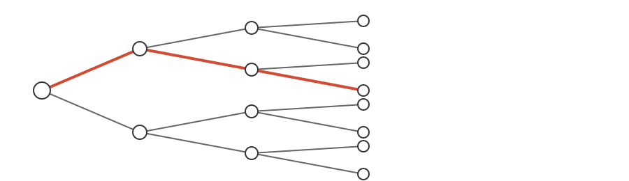
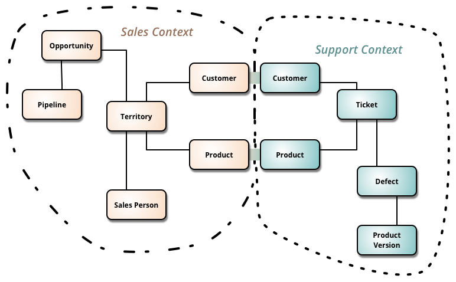
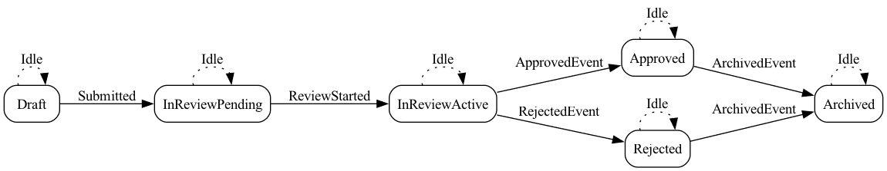
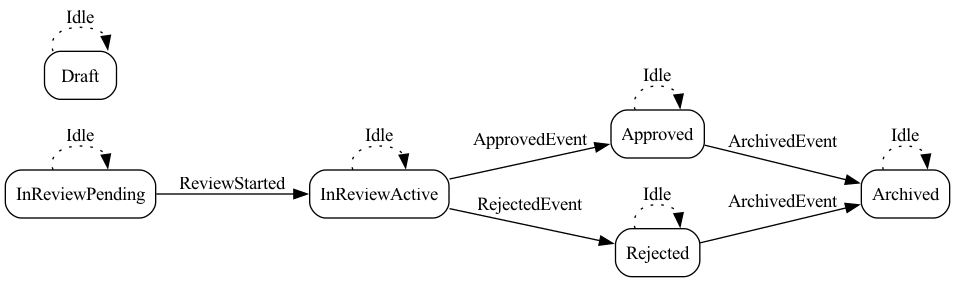
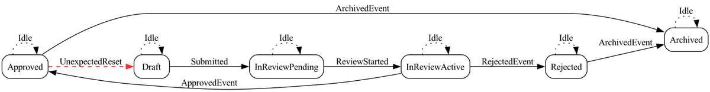

## 自己紹介

- Motoki KAMIMURA
- GitHub: [usabarashi](https://github.com/usabarashi)
- 🧑🏻‍💻: Scala, Rust, TS, HCL, Nix, etc
- 🍵: Home Lab を NixOS ❄️ へリプレイスした 💸

## 今回のお話し

[](https://note.com/motoki_kamimura/n/n276c61df72e4)

使い回しです！ (ドヤ)

## モチベーション

- サービスを拡張するにつれ整合性の維持が難しくなる
- 時間変化の整合性を網羅的に保証する手法が欲しい
- 金融サービスは形式手法のターゲットっぽい？
- モデル検査の入門として Alloy が取っつきやすいらしい？

## 形式手法とは (知らんけど)

- 仕様や設計を曖昧さが少ない形で厳密に記述する
- 記述した性質を検証・証明・解析で確かめる
- 定理証明・モデル検査・型など複数手法がある

## 関係論理 (RL)

- 関係(多対多)で構造を表す論理
- 合成・反転・閉包・集合演算でつなぎ方や範囲を調整する

例: 父方の祖父

$$
Father = Parent \cap Male \\
PaternalGrandfather = Father \circ Father
$$

## 一階述語論理 (FOL)

- 「すべての」「存在する」などで性質を表す論理
- 制約を厳密に書けるので仕様の芯になる

例: すべての注文は顧客を持つ

$$
\forall o.\ Order(o) \rightarrow \exists c.\ Customer(c) \land Has(o, c)
$$

## モデル検査(MC)

- 仕様や性質を論理式で記述する
- 状態空間を自動探索して性質を確かめる
- 反例が出れば仕様の穴, 出なければ成立の根拠になる

例: 状態の組み合わせ

$$
|States| = |S_1| \times |S_2| \times \cdots \times |S_n|
$$

## 有界モデル検査 (BMC)

- 探索深さ $k$ を上限として状態空間を有限化する
- その範囲で性質の成立／反例の有無を自動探索する
- 範囲外については保証しない

例: 時間ごとの状態の組み合わせを $k$ まで連結する

$$
|Trace(k)| = \prod_{t=0}^{k} |States_t|
$$

$$
|States_t| = |S_1^t| \times |S_2^t| \times \cdots \times |S_n^t|
$$

## 線形時相論理 (LTL)

- 時間が1本の流れとして進む前提の時相論理
- いまの状態から先の「振る舞い」を述べる論理
- G(常に) / F(いつか) / X(次) / U(まで) で性質を書く
- 実務ではモデル検査で「反例を探す」場合が多い？

{fig-alt="Binary tree with a highlighted trace (LTL is a single path)" fig-align="center" width="85%"}

## Alloy とは

- Alloy: 関係を中心に仕様を宣言的に書く言語
- Analyzer: SAT に落として反例や具体例を探す
- SAT: ブール式が満たせるかを判定する問題
- Solver: SAT を解く自動探索プログラム
- モードは 2 種類: `run` (例を探す) / `check` (反例を探す)

## 参考: SQL で考えてみる

```sql
SCOPED_STATES =
  FROM S1
  CROSS JOIN S2
  ...
  CROSS JOIN Sn

BASE = SELECT * FROM SCOPED_STATES WHERE <スコープ/前提/不変条件>

TRACES = BASE × BASE × ... × BASE -- (k+1回)

PROPERTY = SELECT * FROM TRACES WHERE <成立条件>

COUNTEREXAMPLE = SELECT * FROM TRACES WHERE <反例条件>

EXISTS(PROPERTY)
NOT EXISTS(COUNTEREXAMPLE)
```

<span style="color:#c00;">注意: メタファーなので厳密な説明じゃないよ</span>

## 業務モデリング

1. 境界を決めてスコープを固定する
1. 状態とイベントを定義する
1. 状態とイベントを記録する
1. 状態遷移を定義する
1. 不変条件を定義する

## 境界づけられたコンテキスト

- 状態爆発を避けるため, 対象のコンテキストを限定する

{fig-alt="Bounded Context diagram (Sales Context / Support Context)" fig-align="center" width="80%"}

<div style="font-size:0.7em; text-align:center;">Source: Martin Fowler, “Bounded Context”</div>

## 状態とイベントを定義する

```alloy
abstract sig Status {}
one sig Draft extends Status {}
abstract sig InReview extends Status {}
one sig InReviewPending extends InReview {}
one sig InReviewActive extends InReview {}
one sig Approved extends Status {}
one sig Rejected extends Status {}
one sig Archived extends Status {}

abstract sig EventType {}
one sig Submitted extends EventType {}
one sig ReviewStarted extends EventType {}
one sig ApprovedEvent extends EventType {}
one sig RejectedEvent extends EventType {}
one sig ArchivedEvent extends EventType {}
one sig Idle extends EventType {}
```

参考: [Domain Modeling Made Functional](https://tatsu-zine.com/books/domain-modeling-made-functional)

## 状態とイベントを記録する

```alloy
sig Reviewer {}

sig Request {
  var status: one Status,
  var assignedTo: lone Reviewer,
  var lastEvent: one EventType // trace 用
}
```

- 構造体で記録したい事実を束ねる
- status が「現在の状態」
- assignedTo は担当 Reviewer
- lastEvent が「直近イベント」

参考: [Pattern: Event sourcing](https://microservices.io/patterns/data/event-sourcing.html)

## 状態遷移を定義する 1

- 成立して良い状態だけ成立させる

参考: [Always-Valid Domain Model](https://enterprisecraftsmanship.com/posts/always-valid-domain-model/)

参考: [Parse, don't validate](https://lexi-lambda.github.io/blog/2019/11/05/parse-don-t-validate/)

注意: Application と Solver は目的が異なるので compile/runtime の軸で比較しない

## 状態遷移を定義する 2

```alloy
pred approve[r: Request] {
  // Guard
  (r.status = InReviewActive) and (some r.assignedTo)
  // 例: 関係操作を使うなら
  // some r.(assignedTo.manager)     // 合成
  // some (~assignedTo).r            // 反転
  // r in r.(dependsOn^)             // 閉包

  // Effect
  r.status' = Approved
  r.lastEvent' = ApprovedEvent

  // Frame
  r.assignedTo' = r.assignedTo
}
```

- pred: 遷移を定義する
- Guard: 遷移が可能な条件を書く (量化/関係操作)
- Effect, Frame: 前後の対応関係を書く

## 不変条件を定義する

```alloy
pred someAction {
  (some r: Request | submit[r]) or
  (some r: Request | startReview[r]) or
  (some r: Request | approve[r]) or
  (some r: Request | reject[r]) or
  (some r: Request | archive[r]) or
  stutter
}

fact reviewerStaysOnInReview {
  always (all r: Request | r.status in InReview implies some r.assignedTo)
}

fact transitions {
  always someAction // 性質は LTL として評価される（CTLではない）
}
```

- fact: 常に成り立つ条件を書く
- always: 全時点で成り立つことを要求する

## テスト駆動開発(TDD)

1. `run` で「仕様を満たす例」を探す
1. CLI で `run` を実行する
1. `check` で「仕様を破る例」を探す
1. CLI で `check` を実行する
1. trace を出力する
1. 状態遷移図を出力する

Visualizer が使いづらいので自作する

## run で「仕様を満たす例」を探す

```alloy
run workflowReviewedApproval {
  #Request = 1
  #Reviewer = 1
  some r: Request |
    eventually (
      r.lastEvent = Submitted and
      eventually (
        r.lastEvent = ReviewStarted and
        eventually (
          r.lastEvent = ApprovedEvent and
          eventually (r.lastEvent = ArchivedEvent)
        )
      )
    )
} for 6 but exactly 1 Request, 1 Reviewer, 6 Time
```

- run: 仕様を満たす例 (インスタンス) が存在するか探す
- eventually: いつか条件が成り立つことを表す
- SAT: 条件を満たす解が存在する (例が得られる) 状態
- UNSAT: 条件を満たす解が存在しない状態

## CLI で run を実行する

```bash
alloy6 commands model.als
alloy6 exec -c <run-id> -r 1 -o out -t json model.als
```

```bash
$ make test
=== Running Run Commands (Satisfiability) ===
  [00] workflowSatisfiable            ✓ SAT (1 instances)
  [01] workflowReviewedApproval       ✓ SAT (1 instances)
  [02] workflowRejectedPath           ✓ SAT (1 instances)
  [03] workflowIdleDraft              ✓ SAT (1 instances)
  [04] workflowIdleApproved           ✓ SAT (1 instances)
  [05] workflowIdleRejected           ✓ SAT (1 instances)
  [08] workflowIdleInReview           ✓ SAT (1 instances)

...

✓ All tests passed
```

- commands で run の ID を確認する
- exec で SAT ならインスタンスが出力される

## check で「仕様を破る例」を探す

```alloy
assert archivedStopsAssignments {
  always (
    all r: Request |
      (r.status = Archived) implies (no r.assignedTo)
  )
}

check archivedStopsAssignments for 6 but exactly 1 Request, 1 Reviewer, 6 Time
```

- check: 仕様 (assert) を破る反例が存在するか探す
- SAT: 反例が見つかる (仕様が破れる) 状態
- UNSAT: 反例が見つからない (仕様が成立) 状態

## CLI で check を実行する

```bash
alloy6 commands model.als
alloy6 exec -c <check-id> -r 1 -o out -t json model.als
```

```bash
$ make test

...

=== Running Check Commands (Assertions) ===
  [06] archivedStopsAssignments       ✓ No counterexample
  [07] approvalOrRejectionExclusive   ✓ No counterexample

✓ All tests passed
```

- commands で check の ID を確認する
- 反例があれば出力される

## trace を出力する

```bash
alloy6 exec -c "$idx" -o "$tmpdir" -t json "$MODEL"
```

```bash
make trace
```

| Step | Status | Assigned To | Event |
|------|--------|-------|-------------|
| 0 | Draft | - | Idle |
| 1 | InReviewPending | Reviewer | Submitted |
| 2 | InReviewActive | Reviewer | ReviewStarted |
| 3 | Approved | Reviewer | ApprovedEvent |
| 4 | Archived | - | ArchivedEvent |
| 5 | Archived | - | Idle |

- run のインスタンスから状態の列を抜き出す
- run の状態列を Markdown に整形する
- check の反例があれば同じファイルに追記する

## 状態遷移図を出力する 1

```bash
$ make diagram
```

{fig-alt="State transition diagram (example 1)" fig-align="center" width="85%"}

- run のトレースから遷移 (from/to/event) を抽出して作る
- 複数 run の遷移を集約し, 重複を除いて可視化する

## 状態遷移図を出力する 2

{fig-alt="State transition diagram (example 2)" fig-align="center" width="85%"}

- 異常: 期待する遷移が欠けている (矢印不足)
- 対応: run のシナリオやスコープを見直し, 遷移が生成される条件を追加する

## 状態遷移図を出力する 3

{fig-alt="State transition diagram (example 3)" fig-align="center" width="85%"}

- 異常: 意図しない遷移が混入している
- 対応: Guard/Effect/Frame や fact を見直して不正遷移を排除する

## 雑感

- モデルの複雑化で状態爆発しやすい
- Verification と Validation の違い
- 人間が把握・判断しやすい可視化に限界がある
- 証明できるならそれに越したことはない
- 自動定理証明が気になる
- ソフトウェア開発現場は工学より技術寄りになりがち

## AI と形式手法とか (雑に)

- [Prediction: AI will make formal verification go mainstream](https://martin.kleppmann.com/2025/12/08/ai-formal-verification.html)
- [Structured Decomposition for LLM Reasoning: Cross-Domain Validation and Semantic Web Integration](https://arxiv.org/abs/2601.01609)
- [LLM-Assisted Formalization Enables Deterministic Detection of Statutory Inconsistency in the Internal Revenue Code](https://arxiv.org/abs/2511.11954)

## 参考文献 (雑に)

- [抽象によるソフトウェア設計−Alloyではじめる形式手法−](https://www.amazon.co.jp/%E6%8A%BD%E8%B1%A1%E3%81%AB%E3%82%88%E3%82%8B%E3%82%BD%E3%83%95%E3%83%88%E3%82%A6%E3%82%A7%E3%82%A2%E8%A8%AD%E8%A8%88%E2%88%92Alloy%E3%81%A7%E3%81%AF%E3%81%98%E3%82%81%E3%82%8B%E5%BD%A2%E5%BC%8F%E6%89%8B%E6%B3%95%E2%88%92-Daniel-Jackson/dp/4274068587) 2011-07-15
  - 2021 年の Mutable Field 前の書籍なので今回の内容はカバーされていません. 読めていません 🙇
- [達人に学ぶSQL徹底指南書 第2版 初級者で終わりたくないあなたへ](https://learning.oreilly.com/library/view/da-ren-nixue-busqlche-di-zhi-nan-shu-di-2ban-chu-ji-zhe-dezhong-waritakunaianatahe/9784798157832/) 2018-10-11
  - 歴史や一階述語論理の小話などが面白い
- [論理哲学論考を解説【哲学】ウィトゲンシュタインが書いた難解本。](https://www.youtube.com/watch?v=sxDT1_7BJ50)
  - 論理でモデリングする考え方の参考までに
